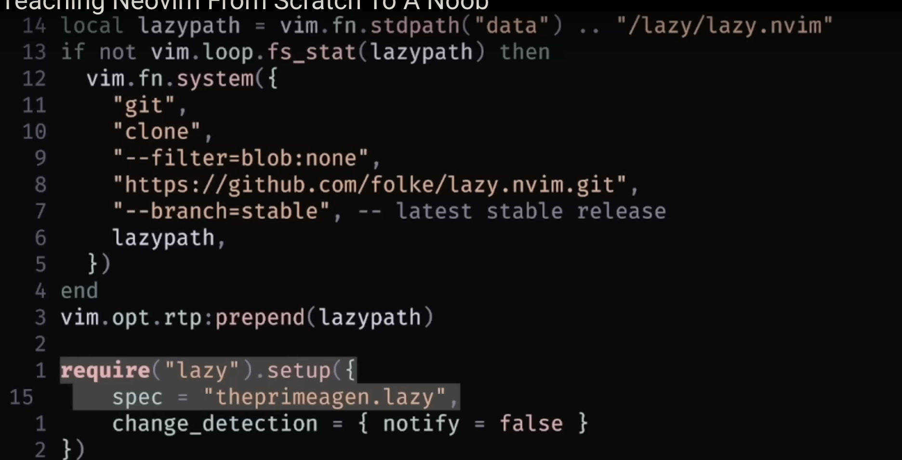
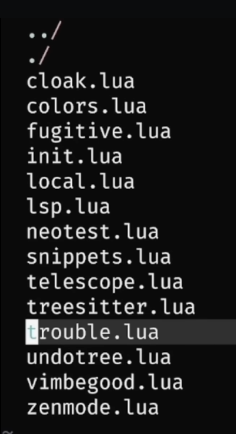

# NVIM

## Future plugins

- https://github.com/kylechui/nvim-surround
- https://github.com/nvim-treesitter/nvim-treesitter-textobjects
- https://github.com/jesseduffield/lazygit
- https://github.com/wakatime/vim-wakatime
- https://github.com/karb94/neoscroll.nvim -> Already installed, check usage. Doesn't seem to work yet
- https://github.com/stevearc/overseer.nvim

- UNDOTREE PLUGIN FOR VISUAL UNDOS

## Peoples usage of nvim

- https://dev.to/kochiyama/kitty-neovim-aesthetic-dev-setup-243l
- https://www.avni.sh/posts/developer-tools/my-development-environment/

## Vim motion tips

- https://vim.rtorr.com/

## VIMdeos

- https://www.youtube.com/watch?v=lWTzqPfy1gE - Vim motions begginer
- https://www.youtube.com/watch?v=nBjEzQlJLHE - Vim motions intermediate

# Vim Motions

## Questions

q. How do i search in telescope without fuzzy?

## Basics

- go to line 78 | => :78
- change inside next " => | ci" (change inner ")

- copy around paragraph | yap (yank around paragrah)

- `(` sentence down
- I insert start of line
- A insert at end of line
- o insert at line bellow
- O insert at line above

- diw delete inner word
- dis delete inner sentence
- dip delete inner paragraph

- daw delete around word
- das delete around sentence
- dap delete around paragraph

- dTa delete to 'a'
- dTe delete to 'e' and so on...

- `.` is the repeat key. Repeat any operation done

- ma marks position a
- mf marks position f
- mg marks position g and so on..

- ` is the bookmark go to
- `a goes to mark a
- `f goes to mark f
- `g goes to mark g and so on...

ThePrimeAgen lazy init

ThePrimeAgen plugins

